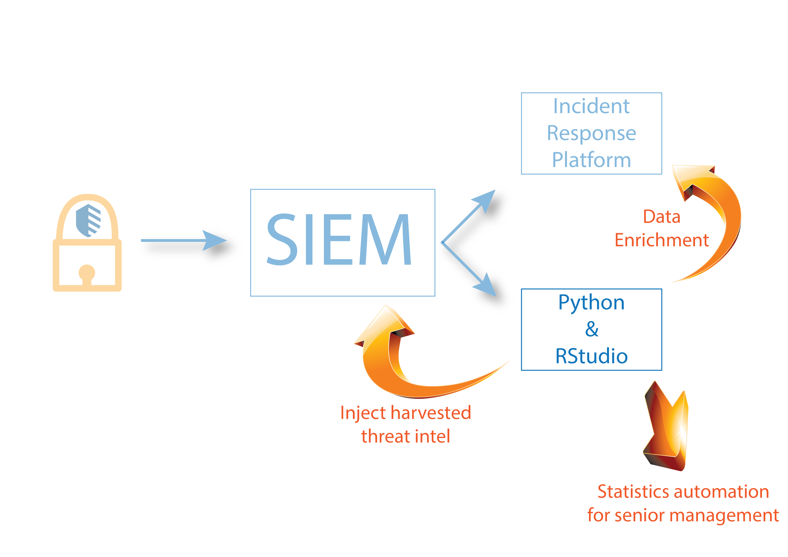

# Extracting Event Statistics from QRadar using Python Code

This is an example of the entire pipeline how you can leverage QRadar to 
aggregate data, extract it and then process it in an external tool
like Python or RStudio.

Depending on what you discover with your analysis you can then feed that 
information back into the SIEM as harvested threat intel or you can enrich
what ever other systems you have in your environment.

Depending on the data you extract, you can then of course apply ML and
other operations to your data.

Prerequisites:

* You need to have an authorised services token and place that in the code

* You need to know the IP address of your QRadar Console

* Before you run this code you need to create the saved search outlined in
rpt_EventStats.aql. If you have your own simply modify the code accordingly

* If there is a firewall between you and the QRadar console you need to open
port 443 or start a VPN client

